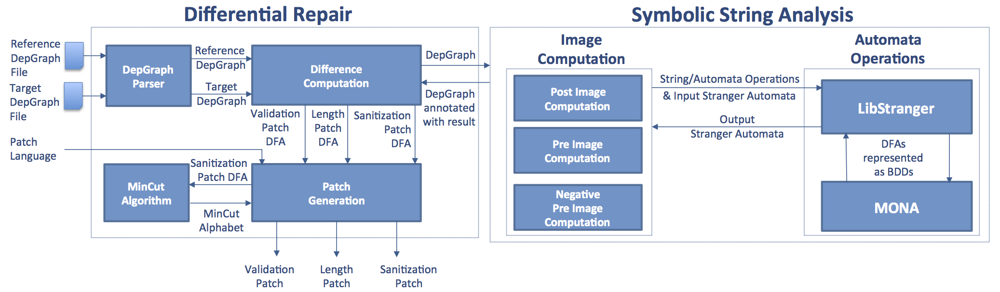
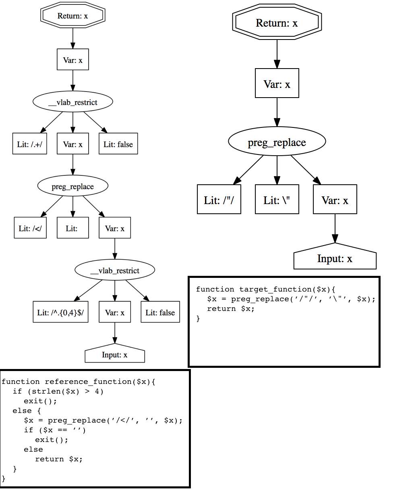

SemRep
=========
SemRep is Semantic Differential Repair tool for input validation and sanitization code. The tool analyzes and repairs validation and sanitization functions against each other. The tool does not need any manual specification or intervention. It takes two functions as Dependency Graphs then it looks for differences in validation and sanitization operations for string variables. If a difference is found, the tool suggests a set of three patch functions that can be used to fix the difference.

One application for the tool is to fix differences between a sanitizer function on the client-side and the correponding one on the server. The tool is language agnostic and can be used with Java, PHP or ASP.NET web applications. To achieve this agnosticism, the tool takes sanitizer functions in an intermediate representation that we call Dependency Graph which will be described in details below.



Installing & Running Binary Files
======================================
The fastest way to try SemRep is to download the self-contained Ubuntu 12.04 64-bit binary files in the zip file [SemRepBinaries.tar.gz](SemRepBinaries.tar.gz). This compressed file contains: 

1. **SemRep** which is a C++ Linux executable file generated with g++-4.8.1 on 64-bit ubuntu 12.04.
2. **mincut_codegen.jar** which is a java jar file.
3. Four C shared libraries (**libmonadfa**, **libmonabdd**, **libmonamem**, **libstranger**) that were generated with gcc-4.8.1 on 64-bit ubuntu 12.04.
4. Three C++ shared libraries (**libboost\_regex-1.48**, **libboost\_system-1.48**, **libboost\_filesystem-1.48**, **libboost\_program\_options-1.48**) which are the same that are packaged with ubuntu 12.04.
5. Two python script: **run\_semrep.py** which is used to run the tool and an auxillary one called **patch\_result\_checker.py** to parse the tool output.

To run the tool and analyze the two example functions that come with it you need to: (1) clone the repository, (2) uncompress the binary files and (3) run the python script. Here is how to do this:
```bash
$> git clone https://github.com/vlab-cs-ucsb/SemRep.git
$> mv ./SemRep/SemRepBinaries .
$> tar -xzvf SemRepBinaries.tar.gz
$> cd SemRepBinaries
# Assuming that you have python and Java installed on your machine 
# the following will analyze and generate patches for the two example
# functions that come with the tool under directory name test
$> python run_semrep.py -r ./test/reference_depgraph.dot -t ./test/target_depgraph.dot -l PHP -f x
...
$> ls output
```
Hopefully, by now you had a successful run (report a bug please if you did not) and your SemRep output directory
has the same tree below:
```
|-- outputs
|                :files generated if there is a patch
|   |-- reference_depgraph_target_depgraph_x_lp_auto.dot
|   |            : length patch automaton to view
|   |-- reference_depgraph_target_depgraph_x_lp_mn_auto.dot
|   |            : used to generate simulation code
|   |-- reference_depgraph_target_depgraph_x_lp_simulation_code.php
|   |            : generated lentgh patch simulation code (.php, .c, or .html(js))
|   |-- reference_depgraph_target_depgraph_x_refsink_mn_auto.dot
|   |            : post image of reference function. Used in mincut calculation only
|   |-- reference_depgraph_target_depgraph_x_result_row.csv
|   |            : performance results
|   |-- reference_depgraph_target_depgraph_x_sp_auto.dot
|   |            : sanitization patch automaton to view
|   |-- reference_depgraph_target_depgraph_x_sp.mincut_summary
|   |            : sanitization patch results (delete, trim, escape)
|   |-- reference_depgraph_target_depgraph_x_sp_mn_auto.dot
|   |            : intermediate result used to calculate mincut
|   |-- reference_depgraph_target_depgraph_x_vp_auto.dot
|   |            : validation patch automaton to view
|   |-- reference_depgraph_target_depgraph_x_vp_mn_auto.dot
|   |            : intermediate result used to generate simulation code
|   |-- reference_depgraph_target_depgraph_x_vp_simulation_code.php
|                : generated validation patch simulation code (.php, .c, .html(js))
```
So, what did SemRep do? SemRep is an automatic repair tool. It takes two functions, a reference and a target, as its input and **generates a patch code** to strengthen the target function against the reference.

1. SemRep took the two input-validation-and-sanitization functions (represented as [dependency graphs]()) that are in the [test](SemRep/test) directory.
2. SemRep ran the differential repair algorithm described [here](Docs/issta14_paper.pdf) and generated a set of patch-automata under directory outputs/generated\_patch\_automata (see [here](http://en.wikipedia.org/wiki/Deterministic_finite_automaton) for more info on what an automata is). You can use xdot (sudo apt-get install xdot) to double click on any of these automata files and see it.
3. Java Code in MinCut package **generated the patch in PHP language** (following input flag -l) in directory outputs/generated\_patch\_codes. The patch is a composition of a number of auto-generated PHP patch-functions that either simulate the automata generated by SemRep or uses the MinCut algorithm.

The user can pass JS instead of PHP to get the patches generated in JavaSript. Generating patches in Javascript allows you to open the html file that contains that javascript patch code and immediately enters inputs to test).

Input format: what is a dependency graph?
-----------------------------------------
SemRep is language agnostic i.e., it can fix different input validation 
and sanitization functions from different programming languages against
each other. To achieve this, SemRep takes an intermediate representation
of a function as its input. We call this representation a Dependency Graph.



The tool takes as input the dependency graphs of two sanitizer functions as
shown in the picture above. 
A dependency graph specifies the data and control flow in the program.
It is a directed graph that has a finite number of nodes and directed edges. 
If there is an edge from node N1 to N2 this means that the value of N1 
depends on the value of N2.
There are five types of nodes:

1. An **input** node identifies the data from untrusted parties, e.g., an input from web forms, that is received as input to the sanitizer.
2. A **literal** node is associated with a constant string value, a regular expression value (which is delimited by the symbol **/** at the beginning and the end) or the special value **false**. Both nodes have no successors. In other words, each of these two types of nodes is always a leaf node.
3. A **return** node which is the root. It represents the positive sink at which the sanitizer returns its output. For each sanitizer, only one **input** node and one **return** node is allowed.
4. An **operation** node represents a string manipulation operation. This type of nodes has one or more successors which represent its parameters. There are three types of string operations: 

  1. General string operations which are **concat** and **replace**. These operations can be used to model a wide range of string functions.
  2. Specialized string operations such as **addslashes** and **htmlspecialchars** which allow for more precise and efficient modeling of some complex and common sanitization operations.
  3. The special string operation **\_vlab\_restrict** which is used to represent control dependencies on branch conditions.

A **concat** node *n* has two successors labeled as the prefix node (*n.p*) and the suffix node (*n.s*), and stores the concatenation of any value of the prefix node and any value of the suffix node in *n*. 

A **replace** node has three successors labeled as the target node (*n.t*), the match node (*n.m*), and the replacement node (*n.r*). For example, let us look at the dependency graph for reference function above on the left ([click here](Docs/depgraphs/refdepgraph.png) for larger figure). In this dependency graph there is one **replace** operation node *n*. *n.m* has the regular expression **/</** as its value, *n.r* has the string value empty string and *n.t* represents the variable **x**.
**replace** performs the following operations for each value of *n.t*: 

1. identifies all the matches, i.e., any value of *n.m*, that appear in *n.t*, 
2. replaces all these matches in *n.t* with any value of *n.r*, and 
3. stores the replaced result in *n*.     

A **\_vlab\_restrict** node has three successors labeled as the condition node (*n.c*), the target node (*n.t*), and the negation node (*n.g*). The condition node *n.c* is a regular expression representing the constraint enforced by the branch condition. The user is responsible for converting the branch condition constraint into a regular expression. To facilitate this task, we allow for the intersection operator **&** in a regular expression (along with the standard union operator **|**) which returns the intersection of two regular languages encoded by two regular expressions. The intersection operator along with the union operator **|** allow to model the logical AND and OR operators in a branch condition. The negation node is used to decide if the dependency on the branch condition comes from the true branch or the false branch. A value **true** means that we should restrict with the negation of the language of the regular expression *n.c* while a value of **false** means that we should restrict with the language of the regular expression *n.c*.

Installation from Source Code
=============================
Most of the tool ([SemRep](SemRep)) is written in C++ while the [MinCut](MinCut) algorithm is implemented in Java.
SemRep depends on two c libraries: [LibStranger](https://github.com/vlab-cs-ucsb/LibStranger) and
[MONA library](http://www.brics.dk/mona/index.html). Instructions for compiling and installing the two libraries
can be find on [LibStranger](https://github.com/vlab-cs-ucsb/LibStranger) website. SemRep also uses 4 C++ libraries: [boost-regex](http://www.boost.org/doc/libs/1_55_0/libs/regex/doc/html/index.html), [boost-filesystem], system and program options).

[SemRep](SemRep) is an Eclipse CDT project. You need to download 
[Eclipse CDT](http://www.eclipse.org/cdt/downloads.php) IDE then import SemRep project from this git repository
into your Eclipse CDT workspace. You can refere to the [screenshots](Docs/SrcShots) in the documentation for more information on how to do that or go to
[here](http://wiki.eclipse.org/EGit/User_Guide#Starting_from_existing_Git_Repositories).
After that, use eclipse to build SemRep.

[MinCut](MinCut) is an Eclipse Java project. You need to download 
[Eclipse](http://www.eclipse.org/downloads/) IDE then import MinCut project from this git repository
into your Eclipse workspace as described
[here](http://wiki.eclipse.org/EGit/User_Guide#Starting_from_existing_Git_Repositories). After that, use eclipse to build MinCut.

